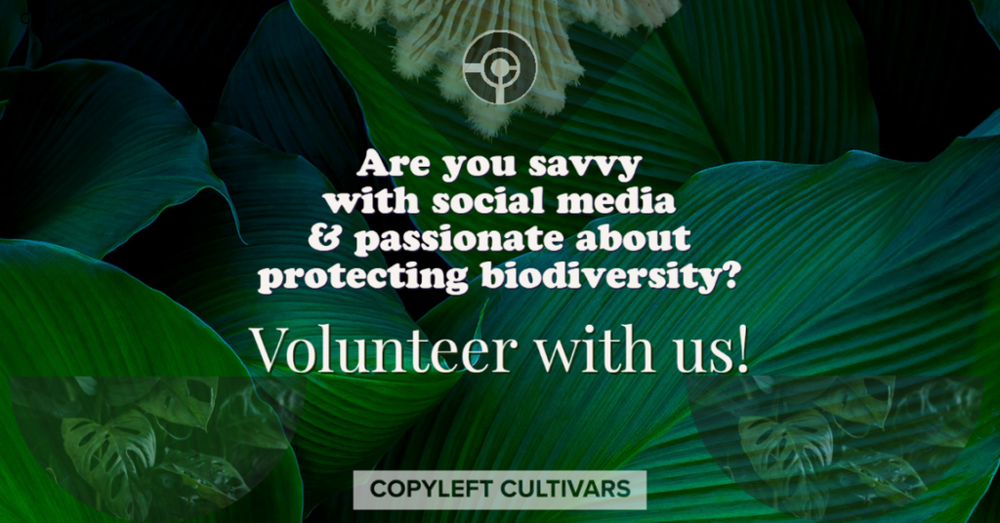

{fig-alt="Volunteer with us — Copyleft Cultivars" .rounded}

# Regenerative Relations Initiative

Indigenous Knowledge Systems have sustained biodiverse ecosystems for millennia
through intentional stewardship and deep place-based ecological relationships. The
Regenerative Relations Initiative recognizes that Indigenous leadership in food
sovereignty, data sovereignty, and land stewardship offers proven pathways toward
ecological resilience and cultural revitalization. Through this initiative, Copyleft
Cultivars seeks to honor and strengthen these knowledge systems by supporting seven
Indigenous communities in their ongoing work of maintaining reciprocal relationships
with land, water, and plant relatives while building regenerative futures rooted in
traditional ecological and cultural knowledge.

Copyleft Cultivars invites Indigenous communities to join our inaugural Regenerative
Relations Initiative (RRI) cohort, an international network focused on advancing land
stewardship, food sovereignty, and data sovereignty through Indigenous-led
regenerative practices.

If you have any questions, please reach out to us at
[regenerativerelations@gmail.com](mailto:regenerativerelations@gmail.com).

[Inaugural Cohort Announcement](https://docs.google.com/document/d/1xlIvfG9_6Mpz1KFiu3_ikssNfVE6XoWD0zvmQDLC85U/edit){.btn .btn-outline-primary role="button"}
[Informational Webinar](https://forms.gle/gjwNotUatkvP8U7h8){.btn .btn-outline-primary role="button"}

# Natural Farming Fertilizer Assistant Chatbot

Conventional farming is hard, expensive, and hurts the environment. Getting help
for sustainable practices is costly and slow. Copyleft Cultivars offers on-demand AI
assistants for regenerative farming through web apps and voice interfaces. Our beta
has over 700 testers and over 100 supporting users across 8 countries and 40 farms,
helping both small farms and large productions. Users have interacted with our
chatbot in more than 100 languages. We are prototyping new AI assistants which work
even without internet access and in various languages, with agronomic precision.

Copyleft Cultivars' Natural Farming Fertilizer Assistant Chatbot aims to create
customized, localized, free Natural Farming fertilizer recipes, most of which can be
made with local free ingredients.

[Access Our Agriculture Assistant](https://www.patreon.com/CopyleftCultivarsNonprofit){.btn .btn-primary role="button"}

# Hugging Face

View our open-source collections, spaces, models, and datasets.

[Hugging Face Hub](https://huggingface.co/CopyleftCultivars){.btn .btn-outline-primary role="button"}

# Upcoming Events

## Regenerative Relations Initiative Informational Webinar

- **Date:** January 20, 2025
- **Time:** 6 pm – 7 pm PST
- **Location:** Zoom (link to be sent upon registration)

Indigenous Knowledge Systems have sustained biodiverse ecosystems for millennia
through intentional stewardship and deep place-based ecological relationships. The
Regenerative Relations Initiative recognizes that Indigenous leadership in food
sovereignty, data sovereignty, and land stewardship offers proven pathways toward
ecological resilience and cultural revitalization.

[Register](https://forms.gle/gjwNotUatkvP8U7h8){.btn .btn-outline-primary role="button"}

## Free the Seeds

**December 8, 2022 @ 10:30 am PST**

Join us for this first-of-its-kind digital ceremonial release event!

We are excited to release the long-awaited Freedom Bag Tag, a unique and easy-to-use
label you can put on new seed packs to legally copyleft-protect them as a public good
and ensure all future users that your seeds have freedom of use.

The Freedom Bag Tag was created over the course of nearly two years, including a very
lively public collaboration to create the text of this freedom-assuring Bag Tag. This
is the first step in our mission to make copyleft and open-source protections
available for the community at large and help us unite together as a community. There
has never been a more important time for this work.

---

## Subscribe to Email Updates

[Subscribe](https://docs.google.com/forms/d/e/1FAIpQLSehSxLrJkMRW9D8YgBJ9zqYBNcYPuu7aBUuEPVdqUOLR93XMw/viewform){.btn .btn-primary role="button"}
